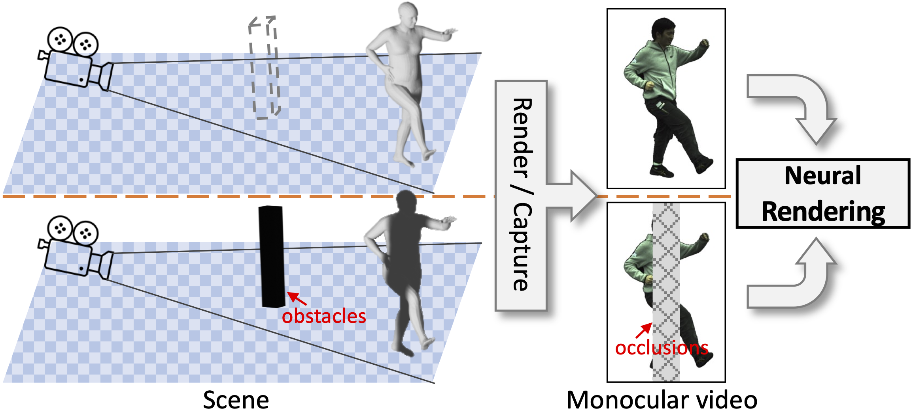

# OccNeRF: Rendering Humans from Object-Occluded Monocular Videos, ICCV 2023

Paper: https://arxiv.org/pdf/2308.04622.pdf




**TO BE UPDATED**

## Citation  

If you find this repo useful in your work or research, please cite:  

```
@InProceedings{Xiang_2023_OccNeRF,
    author    = {Xiang, Tiange and Sun, Adam and Wu, Jiajun and Adeli, Ehsan and Li, Fei-Fei},
    title     = {Rendering Humans from Object-Occluded Monocular Videos},
    booktitle = {Proceedings of the IEEE/CVF International Conference on Computer Vision (ICCV)},
    month     = {October},
    year      = {2023}
}
